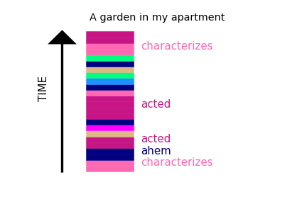

# Spoken-corpus Modeling Network
2019Spring - CS472: Special Topics in Computer Science<Machine learning for social science>

## Requirements

* python 2, numpy, theano==0.8, lasagne
* Recommended to create new virtual environment and run the code

## Dataset
* TED: https://www.kaggle.com/rounakbanik/ted-talks > download 'ted_main.csv' and 'transcripts.csv' to './data' directory.
* GloVe: https://nlp.stanford.edu/projects/glove/ > download '[glove.6B.zip](http://nlp.stanford.edu/data/glove.6B.zip)' to './data' directory, and unzip it (dim=50, 100, 200, 300).

## Source Code

    python ted_reader.py
    
will read 'ted_main.csv' and 'transcripts.csv' to produce 'ted_data.pkl', which will be used in the next step.

    python ted_smn_train.py
    
will train the SMN model and result in the './model'.

    python ted_viz.py

will finally visualize the trajectory into image.

<del>
    python ted_similarity.py 
    
will calculate the similarity between the videos.
</del>

## Reference
We modified original code from https://github.com/miyyer/rmn to build our model to generate trajectory appropriate for our model.
